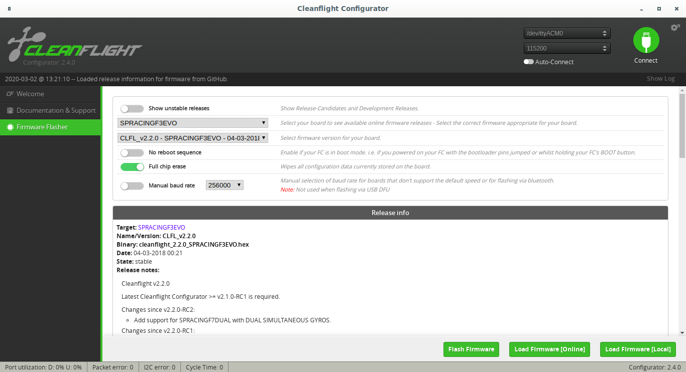
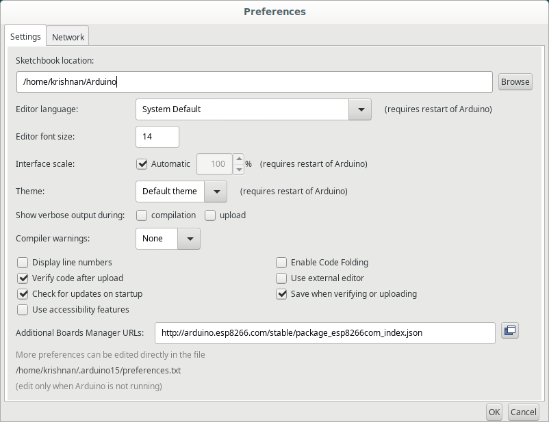
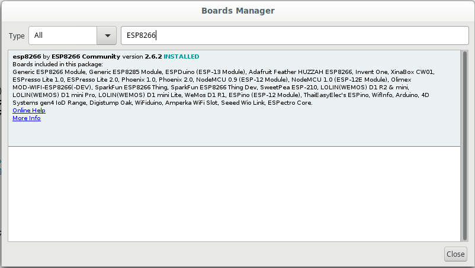

Installation
============

Hardware
++++++++

WiFi Module - ESP8285
#####################

Flashing Circuit for ESP8285
````````````````````````````
For flashing firmware into ESP8285, `FTDI(USB -> Serial) <https://www.amazon.in/FT232Rl-Serial-Converter-Adapter-Arduino/dp/B07H1X2BLQ/ref=asc_df_B07H1X2BLQ/?tag=googleshopdes-21&linkCode=df0&hvadid=397001131891&hvpos=&hvnetw=g&hvrand=2465740708075116030&hvpone=&hvptwo=&hvqmt=&hvdev=c&hvdvcmdl=&hvlocint=&hvlocphy=20461&hvtargid=pla-836112039242&psc=1&ext_vrnc=hi>`_ chip is preferred but you can also use arduino uno or mega
as a programmer. Connections for FTDI with ESP8285 are as follows:

=========      ==========
FTDI            ESP8285
=========      ==========
VCC(3.3v)       EN, VCC
TX3             RX
RX3             TX
GND             GND, GPIO
=========      ==========

Basically, by grounding GPIO will take ESP8285 into the boot mode in which you can flash programs
and it's applicable for all ESP modules. 

Connection to FC
````````````````
WiFi module will communicate to drone on one of serial port(UART3). Hence we need to solder
RX, TX, VCC(3.3V) and GND. Corresponding port will be enabled in the cleanflight configurator.

=========      ========
FC             ESP8285
=========      ========
VCC(3.3v)       EN, VCC
TX3             RX
RX3             TX
GND             GND
=========      ========

Barometer - BMP280 and Magnetometer - QMC5883L
##############################################
BMP280 and QMC5883L will be communicating to FC over a I2C bus(I2C2) whoes pins are mapped over
UART1(PA9: SCL ; PA10: SDA). The corresponding changes would be made in firmware. The connections
are as follows:

===============       ======  ========
FC                    BMP280  QMC5883L
===============       ======  ========
VCC(3.3v)             VCC     VCC
SCL2(TX1)(PA9)        SCL     SCL
SDA2(RX1)(PA10)       SDA     SDA
GND                   GND     GND
===============       ======  ========

Software
++++++++

Flashing Cleanflight Firmware
#############################
Cleanflight firmware is easy to get started with if you don't want to write control algorithms
and HAL drivers for the board all by urself. To flash Cleanflight firmware, you need to install
`Cleanflight configurator chrome extention <https://chrome.google.com/webstore/detail/cleanflight-configurator/enacoimjcgeinfnnnpajinjgmkahmfgb>`_.

Make sure you have `STM32 Virtual COM Port Drivers <https://www.st.com/en/development-tools/stsw-stm32102.html>`_
installed. These drivers will help you to detect and flashing the programs into controller.

Note: Debian or linux users have execute below given commands additionally for flashing the firmware

.. code-block:: bash
    
    $ sudo systemctl stop ModemManager.service
    $ echo 'SUBSYSTEM=="usb", ATTRS{idVendor}=="0483", ATTRS{idProduct}=="df11", MODE="0664", GROUP="plugdev"' | sudo tee /etc/udev/rules.d/45-stdfu-permissions.rules > /dev/null


Once you are done, you can connect FC via USB and open the cleanflight configurator and follow the below mentioned steps

- **Choose Board** as **SPRACINGF3EVO** 
- **Choose Firmware version for SPRACINGF3EVO** as **CLFL_v2.2.0**
- Enable **Full chip erase**
- Click on **Load Firmware(Online)**
- Click on **Flash Firmware** after it gets loaded

This project is very specific about the version because other version might or might not have some functionalities
also some addition support will be added in this firmware version in later phase. Other versions might not support MSP, altitude hold
etc 



Once you are done with flashing the firmware into the FC you can set modes and toggle few settings
to enable MSP over one of the serial ports(UART).

Installing MultiWii Python Library
##################################
To install MultiWii python Library follow the below given steps:

.. code-block:: bash

    $ git clone https://github.com/krish-iyer/hackdrones
    $ cd hackdrones/src/GCS/
    $ pip3 install .

Flashing firmware to ESP8285 using Arduino IDE
##############################################

Before proceeding you need to add board support package for ESP8285 as follows

- Add *http://arduino.esp8266.com/stable/package_esp8266com_index.json* in File > Prefersences
- Now go to Tools > Board > Board Manager
- Install *ESP8266* package
- After connecting FDTI module with ESP8285, select board as **Generic ESP8285 Module**
- Select port For eg: /tty/USB0
- then click on Upload program



